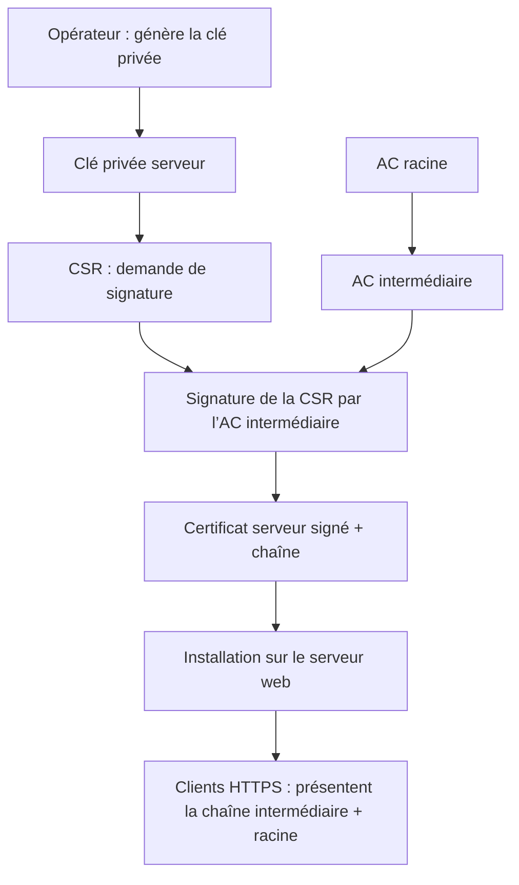
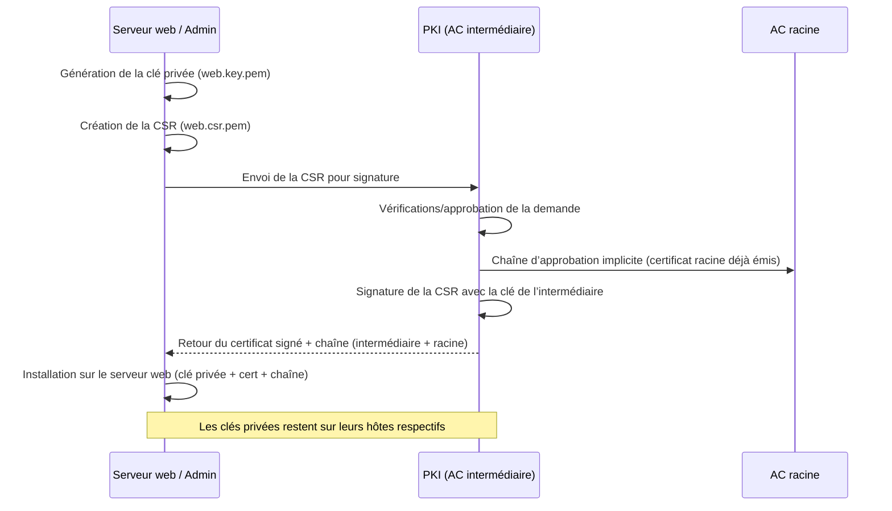

# TP : Monter sa propre PKI avec OpenSSL

Ce guide pas à pas rassemble les commandes pour créer une autorité de certification (AC) racine, une AC intermédiaire, et signer des certificats serveur et client. Tous les exemples sont locaux et reposent sur OpenSSL.

_CECI N'EST PAS PROD READY_

## Concepts clés

- Chaque certificat est signé par l’autorité au-dessus : le certificat serveur est signé par l’AC intermédiaire, elle-même signée par l’AC racine.
- Le client possède déjà l’AC racine dans son magasin d’ancres de confiance et fait confiance à ce qu’elle signe directement ou indirectement.
- Le serveur envoie son certificat et celui de l’intermédiaire ; le client vérifie les signatures en remontant jusqu’à la racine qu’il connaît.
- Si signatures, dates, usages et révocation (CRL/OCSP) sont OK, la connexion est acceptée ; sinon elle est refusée.
- La révocation (CRL/OCSP) rend un certificat non fiable même s’il a été correctement signé à l’origine.

## Diagramme du flux de création de certificat



## Diagramme de séquence (où se passe quoi)



## Pré‑requis

- OpenSSL disponible en ligne de commande (`openssl version` pour vérifier).
- Shell POSIX. Les chemins sont relatifs au dossier courant.

## Préparer l’arborescence de travail

```bash
# Dossier de travail
mkdir -p pki/root/{private,certs,csr,newcerts,crl}
mkdir -p pki/intermediate/{private,certs,csr,newcerts,crl}
mkdir -p pki/{server,client}

# Permissions minimales sur les clés privées
chmod 700 pki/root/private pki/intermediate/private

# Fichiers d’index et numéros de série
touch pki/root/index.txt pki/intermediate/index.txt
echo 1000 > pki/root/serial
echo 2000 > pki/intermediate/serial
echo 3000 > pki/root/crlnumber
echo 4000 > pki/intermediate/crlnumber
```

## 1. Créer l’AC racine

```bash
# Clé privée protégée par mot de passe
openssl genrsa -aes256 -out pki/root/private/ca.key.pem 4096

# Certificat autosigné de l’AC racine
openssl req -x509 -new -key pki/root/private/ca.key.pem -sha256 -days 3650 \
  -out pki/root/certs/ca.cert.pem \
  -subj "/C=FR/O=TP-PKI/OU=Root CA/CN=TP Root CA" \
  -addext "basicConstraints=critical,CA:true,pathlen:1" \
  -addext "keyUsage=critical,keyCertSign,cRLSign" \
  -addext "subjectKeyIdentifier=hash"
```

## 2. Créer l’AC intermédiaire signée par l’AC racine

```bash
# Clé privée de l’intermédiaire
openssl genrsa -aes256 -out pki/intermediate/private/intermediate.key.pem 4096

# CSR pour l’intermédiaire
openssl req -new -key pki/intermediate/private/intermediate.key.pem -sha256 \
  -out pki/intermediate/csr/intermediate.csr.pem \
  -subj "/C=FR/O=TP-PKI/OU=Intermediate/CN=TP Intermediate CA"

# Extensions pour marquer le certificat comme CA intermédiaire
cat > pki/intermediate/intermediate.ext <<'EOF'
basicConstraints=critical,CA:true,pathlen:0
keyUsage=critical,keyCertSign,cRLSign
subjectKeyIdentifier=hash
authorityKeyIdentifier=keyid:always
crlDistributionPoints=URI:http://pki.local/crl/intermediate.crl.pem
authorityInfoAccess=OCSP;URI:http://pki.local/ocsp,caIssuers;URI:http://pki.local/certs/intermediate.cert.pem
EOF

# Signature de la CSR avec l’AC racine
openssl x509 -req -in pki/intermediate/csr/intermediate.csr.pem \
  -CA pki/root/certs/ca.cert.pem -CAkey pki/root/private/ca.key.pem \
  -CAcreateserial -out pki/intermediate/certs/intermediate.cert.pem \
  -days 1825 -sha256 -extfile pki/intermediate/intermediate.ext

# Chaîne complète intermédiaire + racine
cat pki/intermediate/certs/intermediate.cert.pem pki/root/certs/ca.cert.pem \
  > pki/intermediate/certs/chain.cert.pem

# (Option) Fichier de configuration OpenSSL pour l’intermédiaire (CRL & signatures)
cat > pki/intermediate/openssl.cnf <<'EOF'
[ ca ]
default_ca = CA_default

[ CA_default ]
dir               = ./pki/intermediate
certs             = $dir/certs
crl_dir           = $dir/crl
database          = $dir/index.txt
new_certs_dir     = $dir/newcerts
certificate       = $dir/certs/intermediate.cert.pem
serial            = $dir/serial
crlnumber         = $dir/crlnumber
crl               = $dir/crl/intermediate.crl.pem
private_key       = $dir/private/intermediate.key.pem
RANDFILE          = $dir/private/.rand
default_md        = sha256
default_days      = 825
default_crl_days  = 7
default_crl_hours = 0
policy            = policy_loose
copy_extensions   = copy

[ policy_loose ]
countryName             = optional
stateOrProvinceName     = optional
localityName            = optional
organizationName        = optional
organizationalUnitName  = optional
commonName              = supplied
EOF
```

## 3. Générer une clé et une CSR pour un certificat web

```bash
# Clé privée serveur
openssl genrsa -out pki/server/web.key.pem 2048

# CSR pour le serveur (adapter le CN et les SAN)
openssl req -new -key pki/server/web.key.pem -sha256 \
  -out pki/server/web.csr.pem \
  -subj "/C=FR/O=TP-PKI/OU=Web/CN=www.exemple.local"
```

## 4. Signer la CSR serveur avec l’intermédiaire

```bash
# Extensions pour un certificat serveur (avec SAN)
cat > pki/server/web.ext <<'EOF'
basicConstraints=CA:false
keyUsage=critical,digitalSignature,keyEncipherment
extendedKeyUsage=serverAuth
subjectAltName=@alt_names
crlDistributionPoints=URI:http://pki.local/crl/intermediate.crl.pem
authorityInfoAccess=OCSP;URI:http://pki.local/ocsp,caIssuers;URI:http://pki.local/certs/intermediate.cert.pem

[alt_names]
DNS.1=www.exemple.local
DNS.2=exemple.local
EOF

# Signature de la CSR serveur
openssl x509 -req -in pki/server/web.csr.pem \
  -CA pki/intermediate/certs/intermediate.cert.pem \
  -CAkey pki/intermediate/private/intermediate.key.pem \
  -CAcreateserial -out pki/server/web.cert.pem \
  -days 825 -sha256 -extfile pki/server/web.ext
```

## 5. Créer et signer une CSR pour un certificat client

```bash
# Clé privée client
openssl genrsa -out pki/client/client.key.pem 2048

# CSR client (adapter CN et e-mail)
openssl req -new -key pki/client/client.key.pem -sha256 \
  -out pki/client/client.csr.pem \
  -subj "/C=FR/O=TP-PKI/OU=Client/CN=client.demo"

# Extensions pour authentification client
cat > pki/client/client.ext <<'EOF'
basicConstraints=CA:false
keyUsage=critical,digitalSignature,keyEncipherment
extendedKeyUsage=clientAuth,emailProtection
subjectAltName=DNS:client.demo,email:client@example.test
crlDistributionPoints=URI:http://pki.local/crl/intermediate.crl.pem
authorityInfoAccess=OCSP;URI:http://pki.local/ocsp,caIssuers;URI:http://pki.local/certs/intermediate.cert.pem
EOF

# Signature de la CSR client par l’intermédiaire
openssl x509 -req -in pki/client/client.csr.pem \
  -CA pki/intermediate/certs/intermediate.cert.pem \
  -CAkey pki/intermediate/private/intermediate.key.pem \
  -CAcreateserial -out pki/client/client.cert.pem \
  -days 825 -sha256 -extfile pki/client/client.ext
```

## 6. Générer et publier une CRL (intermédiaire)

```bash
# Générer la CRL de l’AC intermédiaire
openssl ca -config pki/intermediate/openssl.cnf -gencrl \
  -out pki/intermediate/crl/intermediate.crl.pem

# Visualiser la CRL
openssl crl -in pki/intermediate/crl/intermediate.crl.pem -text -noout
```

En cas de révocation (avec `openssl ca -config pki/intermediate/openssl.cnf -revoke <cert>`), régénérez la CRL avec la même commande `-gencrl` et republiez le fichier CRL.

> Astuce : exécutez les commandes depuis la racine du dépôt pour que les chemins relatifs du fichier `pki/intermediate/openssl.cnf` fonctionnent (`./pki/intermediate/...`). Si besoin, ajustez `dir =` dans le fichier de configuration pour un chemin absolu.

## Vérifier les certificats

```bash
# Vérifier la chaîne du certificat serveur
openssl verify -CAfile pki/intermediate/certs/chain.cert.pem pki/server/web.cert.pem

# Vérifier la chaîne du certificat client
openssl verify -CAfile pki/intermediate/certs/chain.cert.pem pki/client/client.cert.pem
```

## Démo : serveur web Python (TLS + mTLS)

### Générer un certificat serveur pour localhost

```bash
# Clé privée
openssl genrsa -out pki/server/web.key.pem 2048

# CSR (CN=localhost)
openssl req -new -key pki/server/web.key.pem -sha256 \
  -out pki/server/web.csr.pem \
  -subj "/C=FR/O=TP-PKI/OU=Web/CN=localhost"

# Extensions SAN pour localhost
cat > pki/server/web.ext <<'EOF'
basicConstraints=CA:false
keyUsage=critical,digitalSignature,keyEncipherment
extendedKeyUsage=serverAuth
subjectAltName=DNS:localhost,IP:127.0.0.1
EOF

# Signature par l’intermédiaire
openssl x509 -req -in pki/server/web.csr.pem \
  -CA pki/intermediate/certs/intermediate.cert.pem \
  -CAkey pki/intermediate/private/intermediate.key.pem \
  -CAcreateserial -out pki/server/web.cert.pem \
  -days 825 -sha256 -extfile pki/server/web.ext

# Chaîne complète pour le serveur (cert + intermédiaire)
cat pki/server/web.cert.pem pki/intermediate/certs/intermediate.cert.pem \
  > pki/server/web.fullchain.pem
```

### Code minimal du serveur Python (HTTPS + validation client)

```python
# server.py
import http.server
import ssl

PORT = 4443
SERVER_CERT = "pki/server/web.fullchain.pem"      # cert serveur + intermédiaire
SERVER_KEY = "pki/server/web.key.pem"             # clé privée serveur
CLIENT_CA = "pki/root/certs/ca.cert.pem"          # ou chain.cert.pem si besoin

handler = http.server.SimpleHTTPRequestHandler
httpd = http.server.HTTPServer(("0.0.0.0", PORT), handler)

context = ssl.create_default_context(ssl.Purpose.CLIENT_AUTH)
context.load_cert_chain(certfile=SERVER_CERT, keyfile=SERVER_KEY)
context.load_verify_locations(cafile=CLIENT_CA)
context.verify_mode = ssl.CERT_REQUIRED  # impose un certificat client valide

httpd.socket = context.wrap_socket(httpd.socket, server_side=True)
print(f"Serveur HTTPS démarré sur https://localhost:{PORT}")
httpd.serve_forever()
```

Lancer le serveur :

```bash
python3 server.py
```

### Tester avec un certificat client

Avec `curl` :

```bash
curl -v https://localhost:4443/ \
  --cacert pki/intermediate/certs/chain.cert.pem \
  --cert pki/client/client.cert.pem --key pki/client/client.key.pem
```

Si le certificat client est invalide ou absent, le serveur refuse la connexion (erreur TLS).

### Démo : révoquer le certificat client et regénérer la CRL

```bash
# Révoquer le certificat client
openssl ca -config pki/intermediate/openssl.cnf \
  -revoke pki/client/client.cert.pem

# Regénérer la CRL après révocation
openssl ca -config pki/intermediate/openssl.cnf -gencrl \
  -out pki/intermediate/crl/intermediate.crl.pem

# Vérifier que le numéro de CRL a incrémenté et que le client est listé
openssl crl -in pki/intermediate/crl/intermediate.crl.pem -text -noout | head
```

Pour que les clients refusent un certificat révoqué, ils doivent récupérer la CRL à jour (ou interroger OCSP si vous l’ajoutez). En démo locale, vous pouvez pointer vos clients vers `pki/intermediate/crl/intermediate.crl.pem`.

## Notes pratiques

- Pensez à sauvegarder les mots de passe des clés privées et à restreindre les permissions de fichiers (`chmod 600` pour les clés).
- Les valeurs de `-subj` et des SAN sont à adapter à votre domaine de test.
- Les durées (`-days`) sont volontairement courtes pour l’exercice ; augmentez‑les pour un usage réel.
- Pour un usage réel, ajoutez des points de distribution CRL/OCSP dans vos extensions (`crlDistributionPoints`, `authorityInfoAccess`) et publiez la CRL sur un endpoint HTTP accessible aux clients.

## Pour la production : concepts à approfondir

- **Racine hors ligne** : AC racine déconnectée, clé sur HSM ou support chiffré, usage ponctuel uniquement pour signer les intermédiaires.
- **Intermédiaires durcis** : clés sur HSM si possible, OS minimal, segmentation réseau, supervision et journaux centralisés.
- **Profils de certificats** : numéros de série non prédictibles, SAN obligatoires, EKU précis, `pathlen` pour les CA, durées adaptées (courtes pour les finaux).
- **Révocation** : publication CRL sur HTTP, mise en place OCSP si pertinent, rotation régulière des CRL, tests clients (curl, navigateurs) qui consomment CRL/OCSP.
- **Processus RA/approbation** : validation de l’identité ou du contrôle de domaine, approbation à 4 yeux pour les signatures sensibles.
- **Durcissement TLS** : versions récentes, suites à PFS, désactivation de TLS/algos obsolètes.
- **Sécurité opérationnelle** : sauvegardes chiffrées testées, MFA/RBAC, gestion des secrets, plan de rotation/renouvellement de clés, procédures d’incident.
- **Déploiement des ancres** : méthode pour installer racine/intermédiaire dans les stores clients/serveurs, vérification de compatibilité (mTLS inclus).
